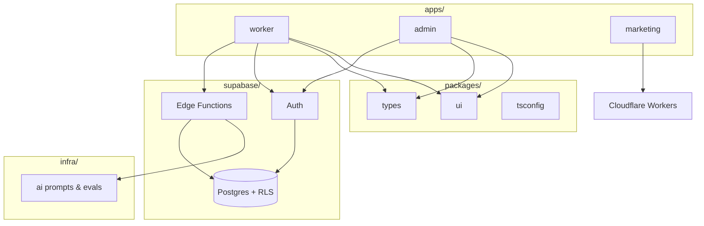
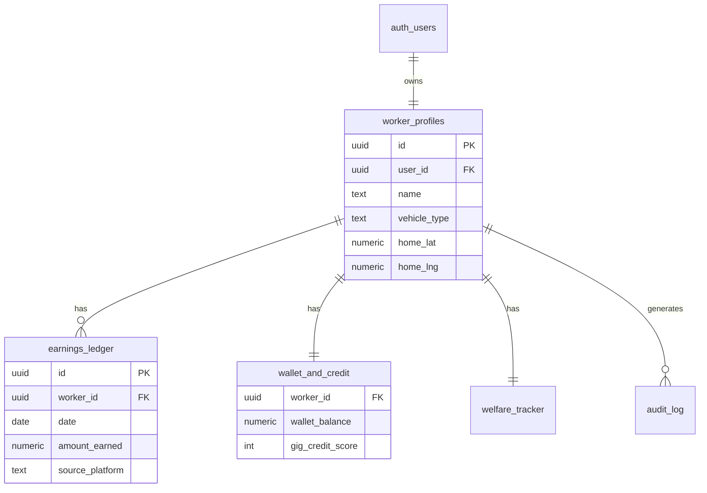
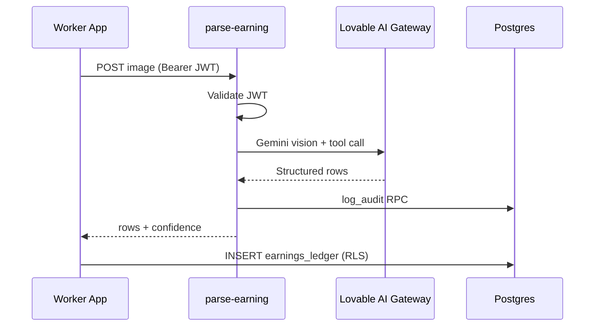

# GigAI Bharat — System Architecture

> **Status:** Monorepo v0.1 — worker product in prototype, admin scaffolded, marketing live-ready on Cloudflare.

## 1. Vision alignment

GigAI Bharat is a **four-layer mobility OS**:

1. **Experience layer** — worker, admin, and public web apps  
2. **Edge layer** — SSR (marketing), Supabase Edge Functions (AI, webhooks)  
3. **Data layer** — Postgres with row-level security, audit trail  
4. **Intelligence layer** — vision OCR today; shift coach & demand ML tomorrow  

Worker ownership is enforced by **RLS-bound data access**, exportable ledgers, and transparent audit logs — not by blockchain theater.

---

## 2. Monorepo topology



### Package boundaries

| Package | Responsibility | Depends on |
|---------|----------------|------------|
| `@gigai/worker` | Worker UX, client-side hooks | Supabase client, Maps |
| `@gigai/admin` | Ops dashboard (privileged reads TBD) | Supabase client |
| `@gigai/marketing` | SSR storytelling, SEO | None (backend-free) |
| `@gigai/ui` | Design tokens & primitives | React |
| `@gigai/types` | Domain types + `Database` codegen | — |
| `supabase/*` | Schema, RLS, server AI | — |

**Rule:** Apps never import each other. Shared code lives in `packages/*`.

---

## 3. Domain model (current)



### RPCs (server-enforced business logic)

| Function | Purpose |
|----------|---------|
| `owns_worker` | RLS helper |
| `increment_balance` / `decrement_balance` | Wallet mutations |
| `increment_score` | Credit score |
| `accept_loan` | Lending stub |
| `log_audit` | Compliance trail |
| `handle_new_worker` | Signup trigger (demo seed in dev) |

---

## 4. Request flows

### 4.1 Earnings OCR (implemented)



### 4.2 Admin read (planned)

Admin browser **must not** hold service role keys. Pattern:

```
Admin UI → Edge Function `admin-query` → service role server-side → filtered JSON
```

---

## 5. Security architecture

| Control | Implementation |
|---------|----------------|
| Authentication | Supabase Auth (expand to phone OTP) |
| Authorization | Postgres RLS on all worker tables |
| AI abuse prevention | JWT on Edge Functions + future quotas |
| Audit | `audit_log` + `log_audit` RPC |
| Secrets | Supabase secrets + CI vault — never in git |
| Admin isolation | Private subdomain + SSO / IP allowlist |

See [SECURITY.md](./SECURITY.md).

---

## 6. AI infrastructure (phased)

| Phase | Capability | Location |
|-------|------------|----------|
| **0** (now) | Screenshot → earnings rows | `supabase/functions/parse-earning` |
| **1** | Low-confidence review queue | `pending_earnings` table + admin UI |
| **2** | Shift coach RAG | New Edge Function + `infra/ai/prompts/` |
| **3** | Voice onboarding | Whisper + TTS function |
| **4** | Demand forecasting | Batch worker (Node or Supabase cron) |

Design principles: **structured outputs**, **human-in-the-loop**, **audit every call**, **no direct DB writes from models**.

Details: [infra/ai/README.md](./infra/ai/README.md)

---

## 7. Deployment architecture

| Component | Platform |
|-----------|----------|
| Marketing | Cloudflare Workers |
| Worker SPA | Vercel / Cloudflare Pages |
| Admin SPA | Private Vercel + Access |
| Database + Auth + Functions | Supabase |

See [docs/DEPLOYMENT.md](./docs/DEPLOYMENT.md).

---

## 8. Scalability notes

| Concern | Approach |
|---------|----------|
| 10M workers | Supabase scale-up + read replicas; partition ledger by `created_at` |
| Realtime dispatch | Supabase Realtime or dedicated queue (Redis / SQS) at Phase 2 |
| Maps cost | Lazy-load Maps SDK; cache geocodes |
| AI cost | Per-user daily quotas; batch off-peak inference |
| Team scale | Monorepo + CODEOWNERS per `apps/*` |

---

## 9. What we intentionally defer

- **Standalone Node.js API** — add BFF only when Edge Functions limit is hit  
- **React Native** — PWA first for Android gig workers  
- **Microservices** — modular monolith in Supabase until team &gt; 15 engineers  

---

## 10. Decision log

| Date | Decision | Rationale |
|------|----------|-----------|
| 2026-05 | npm workspaces + Turbo | Solo-founder simplicity, investor-familiar |
| 2026-05 | Supabase at repo root | Single migration history |
| 2026-05 | Separate admin app | Blast radius + access control |
| 2026-05 | Marketing on Cloudflare | SSR + edge performance |

---

*Maintained by the founding engineering team. Update this doc when schema or boundaries change.*
