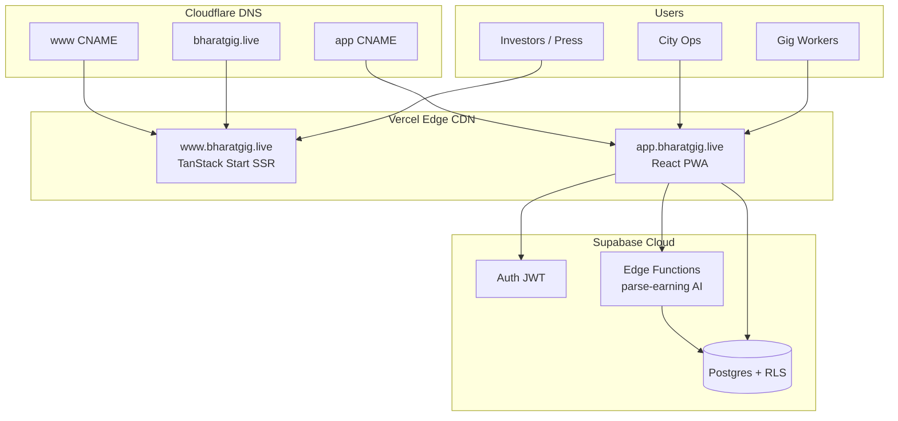
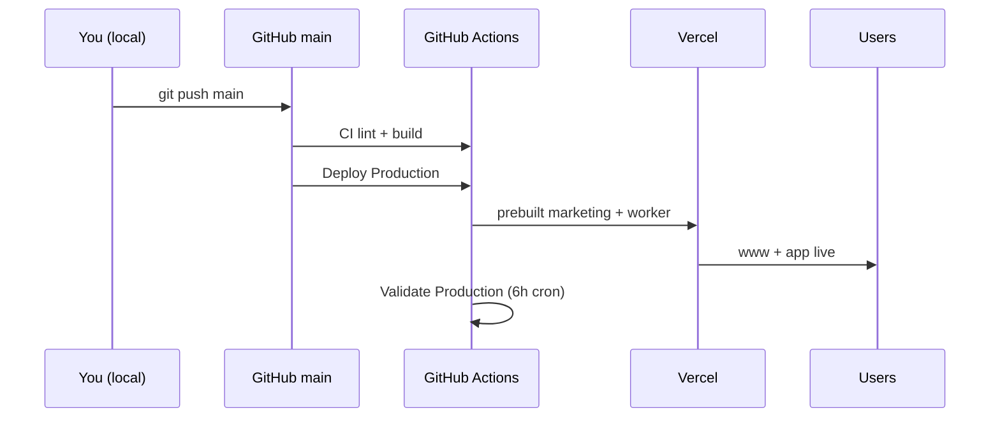

# Founder Launch Guide — GigAI Bharat

**Stop coding. Start shipping.** This is your single playbook from zero to investor-ready production.

**Live:** https://www.bharatgig.live · **App:** https://app.bharatgig.live · **Repo:** https://github.com/pachihumbi/gigai-bharat

---

## 1. Architecture (what you built)



| Layer | Folder | Host |
|-------|--------|------|
| Frontend (marketing) | `apps/marketing` | www.bharatgig.live |
| Frontend (worker) | `apps/worker` | app.bharatgig.live |
| Backend | `supabase/` | Supabase hosted |
| API | `supabase/functions/` | Edge Functions |
| Deploy docs | `deployment/` | — |

---

## 2. Copy-paste: first-time GitHub setup

```powershell
cd "C:\Users\TEMP.DELL\Desktop\Documents → GigAI"
git remote -v
git checkout main
git pull origin main
git checkout -b develop
git push -u origin develop
git checkout main
```

Add GitHub secrets → see `deployment/GITHUB_SETUP.md`.

---

## 3. Copy-paste: deploy to production

```powershell
cd "C:\Users\TEMP.DELL\Desktop\Documents → GigAI"
npm install
npm run build
npm run health:production
git add .
git commit -m "chore: founder production launch"
git push origin main
```

**Or** force fresh Vercel build:

GitHub → Actions → **Deploy Production** → Run workflow → `skip_cache: true`

---

## 4. Copy-paste: DNS fix (Cloudflare)

Log in to Cloudflare → **bharatgig.live** → DNS:

```
Type    Name    Content                 Proxy
A       @       76.76.21.21             DNS only (grey)
CNAME   www     cname.vercel-dns.com    DNS only (grey)
CNAME   app     cname.vercel-dns.com    DNS only (grey)
```

Vercel → **gigai-bharat** → Domains → add `www.bharatgig.live` + `bharatgig.live`  
Vercel → **gigai-bharat-worker** → Domains → add **only** `app.bharatgig.live`

Wait 15–60 min. Verify:

```powershell
npm run health:production
```

Full troubleshooting → `deployment/DNS_SETUP.md`

---

## 5. Deployment workflow



---

## 6. DNS fix checklist

- [ ] Cloudflare nameservers active at registrar
- [ ] A record `@` → `76.76.21.21`
- [ ] CNAME `www` → `cname.vercel-dns.com`
- [ ] CNAME `app` → `cname.vercel-dns.com`
- [ ] `www` attached to **marketing** Vercel project only
- [ ] `app` attached to **worker** Vercel project only
- [ ] SSL shows secure padlock on all three URLs
- [ ] Apex redirects to www
- [ ] `/driver-app` on www redirects to app (edge redirect, no SSR route)
- [ ] `npm run health:production` passes

---

## 7. GitHub best practices (solo → team)

| Practice | Action |
|----------|--------|
| Protected `main` | Require PR + CI green |
| `develop` branch | Daily work merges here first |
| Conventional commits | `feat(worker):`, `fix(marketing):` |
| PR template | `.github/pull_request_template.md` |
| CODEOWNERS | `.github/CODEOWNERS` |
| Tags | `v0.1.0-launch`, `worker-v0.2.0` |
| No secrets in git | Use GitHub Secrets + Vercel env |

---

## 8. Future scaling roadmap

| Phase | When | What |
|-------|------|------|
| **Launch** (now) | Week 0 | Vercel + Supabase + Cloudflare DNS |
| **Observe** | Week 1–2 | Vercel Analytics, UptimeRobot, Sentry on worker |
| **Staging** | Month 1 | `preview.bharatgig.live`, `app-staging` Vercel projects |
| **Admin** | Month 1 | `admin.bharatgig.live` private Vercel + auth gate |
| **Email** | Month 1 | `hello@` via Cloudflare Email Routing |
| **Fonts** | Month 2 | Self-host fonts (India latency) |
| **Team** | Hire #1 | Extract `@gigai/ui`, CODEOWNERS per app |
| **Scale** | Series A prep | Supabase read replicas, CDN for assets, PostHog funnels |

Detail → `docs/CTO_ROADMAP.md`

---

## 9. What to tell investors

> "We're live at **bharatgig.live**. Public narrative on www; worker product on app.bharatgig.live/demo. Architecture is Supabase RLS + Vercel edge + MIT monorepo on GitHub. DPDP-first, zero secrets on marketing."

**Links:** www · app demo · GitHub · hello@bharatgig.live

---

## 10. You are launch-ready when

1. `npm run health:production` → all OK  
2. LinkedIn OG preview works for www  
3. GitHub Actions CI green  
4. Email `hello@` forwards to you  
5. You have **not** touched code for 48h and nothing broke  

**Pause development. Talk to users and investors.**
