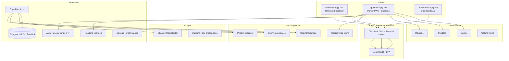

# GigAI Bharat — Zero-Cost Open Infrastructure Playbook

**Domain:** https://www.bharatgig.live  
**Worker app:** https://app.bharatgig.live  
**Stack philosophy:** Linux + Mozilla + OpenStreetMap + Supabase + Vercel free tier  
**Cost target:** ₹0–₹2,000/mo until 10K MAU (Supabase Pro optional)

---

## Executive summary

| Layer | Choice | Why |
|-------|--------|-----|
| Maps | **MapLibre GL** + OSM tiles | Vector dark maps, zero API key, mobile GPU |
| Geocoding | **Photon** (primary) + **Nominatim** (fallback) | Free, India coverage, no key |
| Routing | **OpenRouteService** + **OSRM** public | Free tier + unlimited public demo |
| EV data | **OpenChargeMap** + **data.gov.in** | Free charging POIs + India gov datasets |
| Auth + DB | **Supabase** (already deployed) | Auth, RLS, Realtime, Edge Functions |
| AI | **Ollama** + **OpenRouter free** + **HF Inference** | No Gemini billing dependency |
| Analytics | **Plausible** + **PostHog free** + **Sentry free** | Privacy-first, startup tiers |
| Deploy | **Vercel** + **Cloudflare** + **GitHub Actions** | Already wired in repo |

**Migration from current state:** Replace `loadGoogleMaps.ts`, `PlacePicker.tsx`, `MapPage.tsx` Google deps with `@gigai/maps` package (see Phase 1).

---

## 1. Exact free APIs list

### Maps & location (Phase 1)

| Service | Endpoint | Auth | Limits | Use |
|---------|----------|------|--------|-----|
| **OpenStreetMap tiles** | `https://tile.openstreetmap.org/{z}/{x}/{y}.png` | None | 1 req/s (policy) | Fallback raster |
| **OpenFreeMap vector** | `https://tiles.openfreemap.org/styles/liberty` | None | Fair use | MapLibre style (free) |
| **Protomaps PMTiles** | Self-host or CDN | None | Unlimited if self-hosted | Vector tiles at scale |
| **Nominatim** | `https://nominatim.openstreetmap.org/search` | User-Agent header | 1 req/s | Reverse/forward geocode |
| **Photon (Komoot)** | `https://photon.komoot.io/api/?q=` | None | Fair use | Autocomplete (PlacePicker) |
| **OpenRouteService** | `https://api.openrouteservice.org/v2/directions/driving-car` | Free API key | 2,000 req/day | Route + matrix |
| **OSRM demo** | `https://router.project-osrm.org/route/v1/driving/` | None | Demo only | Dev/fallback routing |
| **Overpass API** | `https://overpass-api.de/api/interpreter` | None | Fair use | POI queries (chargers, bus stops) |
| **Open-Meteo** | `https://api.open-meteo.com/v1/forecast` | None | Unlimited | Weather for dispatch |

### EV & mobility (Phase 2)

| Service | Endpoint | Auth | Use |
|---------|----------|------|-----|
| **OpenChargeMap** | `https://api.openchargemap.io/v3/poi/` | Free API key | EV charger POIs |
| **OpenChargeMap reference** | `/referencedata/` | Key | Connector types |
| **data.gov.in** | `https://api.data.gov.in/resource/{resource_id}` | Free API key | India transport/EV datasets |
| **GTFS India (community)** | GitHub mirrors / state portals | None | Public transit |
| **e-Amrit EV portal scrape** | Via Edge Function cache | N/A | Supplement OCM India gaps |

### Auth (Phase 3) — Supabase (chosen)

| Feature | Provider | Cost |
|---------|----------|------|
| Google OAuth | Supabase Auth | Free |
| Email magic link / OTP | Supabase Auth + Resend SMTP | Free tier |
| Phone OTP | Supabase Auth (Twilio/MessageBird optional) | SMS cost only |
| Session JWT | Supabase | Included |

### Government data (Phase 5)

| Source | API | Key |
|--------|-----|-----|
| **data.gov.in** | REST JSON | Register at data.gov.in |
| **OpenWeather (free)** | One Call 3.0 | 1,000 calls/day free |
| **IMD open data** | CSV/manual ingest | No API — batch import |
| **MoRTH road stats** | data.gov.in resources | API key |

**Explicitly excluded:** Aadhaar, DigiLocker enterprise, paid MapMyIndia, Google Maps Platform.

### AI (Phase 8)

| Service | Endpoint | Cost |
|---------|----------|------|
| **Ollama** | `http://localhost:11434` or Fly.io | Self-host free |
| **OpenRouter** | `https://openrouter.ai/api/v1/chat/completions` | Free model routes |
| **Hugging Face Inference** | `https://api-inference.huggingface.co` | Free tier |
| **sentence-transformers** | Local via Ollama / Python sidecar | Free |

### Analytics & monitoring (Phase 7)

| Tool | Tier | Host |
|------|------|------|
| **Plausible** | 10K pageviews trial → self-host | `analytics.bharatgig.live` |
| **PostHog** | 1M events/mo free | Cloud |
| **Sentry** | 5K errors/mo free | Cloud |
| **Uptime Kuma** | Self-host | Docker on Fly.io/Railway free |
| **Grafana Cloud** | Free tier | Cloud |

---

## 2. Exact architecture



### Data flow: worker location (realtime)

```
Capacitor Geolocation → worker app (5–15s interval when on-shift)
  → Supabase Realtime broadcast OR upsert worker_locations
  → RLS: worker writes own row; operators read city bbox
  → Admin dashboard subscribes to city channel
  → MapLibre layer updates marker + heatmap source
```

### Data flow: route optimization

```
Worker selects job → Edge Function route-optimize
  → OpenRouteService matrix (batch jobs near worker)
  → Returns ordered stops + polyline GeoJSON
  → MapLibre draws route layer (no Google)
```

---

## 3. Exact folder structure

Extends existing monorepo — **do not replace**, **add**:

```
gigai-bharat/
├── apps/
│   ├── marketing/                    # unchanged — zero map secrets
│   ├── worker/
│   │   └── src/
│   │       ├── components/maps/      # NEW: GigMap, ChargerLayer, HeatmapLayer
│   │       ├── hooks/
│   │       │   ├── useGeolocation.ts # NEW: Capacitor + web fallback
│   │       │   ├── useNearbyJobs.ts  # NEW
│   │       │   └── useEvChargers.ts  # NEW
│   │       └── lib/maps/             # NEW: thin re-exports from @gigai/maps
│   └── admin/
│       └── src/pages/
│           ├── OpsMapPage.tsx        # NEW: city command center
│           └── EvIntelPage.tsx       # NEW: charging heatmaps
│
├── packages/
│   ├── maps/                         # NEW @gigai/maps
│   │   ├── src/
│   │   │   ├── maplibre/
│   │   │   │   ├── createMap.ts
│   │   │   │   ├── darkStyle.json
│   │   │   │   └── layers/
│   │   │   ├── geocode/
│   │   │   │   ├── photon.ts
│   │   │   │   └── nominatim.ts
│   │   │   ├── routing/
│   │   │   │   ├── openRouteService.ts
│   │   │   │   └── haversine.ts
│   │   │   ├── ev/
│   │   │   │   └── openChargeMap.ts
│   │   │   └── geofence/
│   │   │       └── pointInPolygon.ts
│   │   └── package.json
│   ├── geo/                          # NEW @gigai/geo — shared types
│   │   └── src/types.ts              # LatLng, GeoJSON, Job, Charger
│   └── types/                        # existing — add DB types for new tables
│
├── supabase/
│   ├── migrations/
│   │   └── YYYYMMDD_maps_ev_intel.sql   # PostGIS + location tables
│   └── functions/
│       ├── geocode-proxy/            # Rate-limit + cache geocoding
│       ├── route-optimize/
│       ├── sync-chargers/            # Cron: OCM → chargers table
│       ├── gov-data-ingest/          # data.gov.in → city_stats
│       ├── ai-dispatch/              # Ollama/OpenRouter matching
│       └── parse-earning/            # existing — migrate off Gemini
│
├── infra/
│   ├── ai/
│   │   ├── ollama/
│   │   │   └── Modelfile              # llama3.2 + custom system prompt
│   │   └── embeddings/               # sentence-transformers sidecar (optional)
│   └── monitoring/
│       ├── uptime-kuma/              # docker-compose snippet
│       ├── grafana/dashboards/
│       └── plausible/                # self-host compose
│
└── docs/
    └── OPEN_INFRA_STACK.md           # this file
```

---

## 4. Exact environment variables

### Root `.env.local` / `apps/worker/.env.local`

```bash
# --- Core ---
APP_ENV=development
VITE_ALLOW_INVESTOR_DEMO=true

# --- Supabase (worker + admin) ---
VITE_SUPABASE_URL=https://YOUR_PROJECT.supabase.co
VITE_SUPABASE_PUBLISHABLE_KEY=eyJ...
VITE_SUPABASE_PROJECT_ID=YOUR_PROJECT

# --- Maps: OPEN stack (replaces Google) ---
VITE_MAP_PROVIDER=maplibre
VITE_MAP_STYLE_URL=https://tiles.openfreemap.org/styles/dark
VITE_MAP_DEFAULT_CENTER=77.5946,12.9716
VITE_MAP_DEFAULT_ZOOM=12

# Geocoding — client calls Edge Function proxy, NOT raw Nominatim from browser
VITE_GEO_PROXY_URL=https://YOUR_PROJECT.supabase.co/functions/v1/geocode-proxy

# --- REMOVE / leave empty (delete Google keys) ---
# VITE_LOVABLE_CONNECTOR_GOOGLE_MAPS_BROWSER_KEY=
# VITE_LOVABLE_CONNECTOR_GOOGLE_MAPS_TRACKING_ID=

# --- Analytics (public) ---
VITE_PLAUSIBLE_DOMAIN=app.bharatgig.live
VITE_POSTHOG_KEY=phc_...
VITE_POSTHOG_HOST=https://us.i.posthog.com
VITE_SENTRY_DSN=https://...@sentry.io/...

# --- Feature flags ---
VITE_ENABLE_LIVE_LOCATION=true
VITE_ENABLE_EV_MAP=true
```

### Supabase Edge Function secrets (Dashboard → Edge Functions → Secrets)

```bash
OPENROUTESERVICE_API_KEY=          # openrouteservice.org — free signup
OPENCHARGEMAP_API_KEY=             # openchargemap.org/site/develop/api
DATA_GOV_IN_API_KEY=               # data.gov.in
OPENROUTER_API_KEY=                # optional — free models
HF_API_TOKEN=                      # huggingface.co — free inference
OLLAMA_BASE_URL=http://localhost:11434  # or https://ollama.fly.dev
RESEND_API_KEY=                    # auth emails (already used on marketing)
SUPABASE_SERVICE_ROLE_KEY=         # auto for some functions; set for cron
GEOCODE_CACHE_TTL_SECONDS=86400
RATE_LIMIT_GEO_PER_MIN=30
```

### Marketing (`apps/marketing` — Vercel only)

```bash
VITE_SITE_URL=https://www.bharatgig.live
RESEND_API_KEY=re_...
EMAIL_FROM=GigAI Bharat <no-reply@bharatgig.live>
TURNSTILE_SECRET_KEY=...
VITE_TURNSTILE_SITE_KEY=...
VITE_PLAUSIBLE_DOMAIN=bharatgig.live
# NO Supabase keys on marketing
```

### GitHub Actions secrets

```bash
VERCEL_TOKEN=
VERCEL_ORG_ID=
VERCEL_MARKETING_PROJECT_ID=
VERCEL_WORKER_PROJECT_ID=
SUPABASE_ACCESS_TOKEN=             # supabase login token for CI migrations
SENTRY_AUTH_TOKEN=                   # optional source maps
```

---

## 5. Exact setup commands

### 5.1 Bootstrap monorepo (existing devs)

```powershell
git clone https://github.com/pachihumbi/gigai-bharat.git
cd gigai-bharat
npm install
cp .env.example .env.local
cp .env.example apps/worker/.env.local
# Edit env vars per section 4
```

### 5.2 Supabase local + PostGIS

```powershell
# Install Supabase CLI: https://supabase.com/docs/guides/cli
supabase start
supabase db reset
supabase migration new maps_ev_intel
# Paste SQL from section 5.3 into the new migration file
supabase db reset
supabase gen types typescript --local > packages/types/src/database.ts
```

### 5.3 PostGIS migration (copy into new migration)

```sql
CREATE EXTENSION IF NOT EXISTS postgis;

-- Live worker location (RLS: own row only)
CREATE TABLE public.worker_locations (
  worker_id UUID PRIMARY KEY REFERENCES public.worker_profiles(id) ON DELETE CASCADE,
  geom geography(POINT, 4326) NOT NULL,
  heading REAL,
  speed_mps REAL,
  on_shift BOOLEAN NOT NULL DEFAULT false,
  updated_at TIMESTAMPTZ NOT NULL DEFAULT now()
);
ALTER TABLE public.worker_locations ENABLE ROW LEVEL SECURITY;

CREATE POLICY "location self upsert" ON public.worker_locations
  FOR ALL USING (public.owns_worker(worker_id))
  WITH CHECK (public.owns_worker(worker_id));

CREATE POLICY "operators read bbox" ON public.worker_locations
  FOR SELECT USING (
    (auth.jwt() -> 'app_metadata' ->> 'role') IN ('operator', 'admin', 'founder')
  );

-- EV chargers cache (populated by Edge Function cron)
CREATE TABLE public.ev_chargers (
  id BIGINT PRIMARY KEY,
  name TEXT,
  geom geography(POINT, 4326) NOT NULL,
  connector_types JSONB,
  power_kw REAL,
  operator TEXT,
  ocm_raw JSONB,
  updated_at TIMESTAMPTZ NOT NULL DEFAULT now()
);
CREATE INDEX ev_chargers_geom_idx ON public.ev_chargers USING GIST (geom);
ALTER TABLE public.ev_chargers ENABLE ROW LEVEL SECURITY;
CREATE POLICY "chargers public read" ON public.ev_chargers FOR SELECT USING (true);

-- Jobs with location
CREATE TABLE public.jobs (
  id UUID PRIMARY KEY DEFAULT gen_random_uuid(),
  title TEXT NOT NULL,
  geom geography(POINT, 4326) NOT NULL,
  payout_inr NUMERIC(10,2),
  status TEXT NOT NULL DEFAULT 'open',
  city TEXT NOT NULL DEFAULT 'Bengaluru',
  created_at TIMESTAMPTZ NOT NULL DEFAULT now()
);
CREATE INDEX jobs_geom_idx ON public.jobs USING GIST (geom);
ALTER TABLE public.jobs ENABLE ROW LEVEL SECURITY;
CREATE POLICY "jobs read authenticated" ON public.jobs FOR SELECT TO authenticated USING (true);

-- Nearby jobs RPC
CREATE OR REPLACE FUNCTION public.nearby_jobs(lat DOUBLE PRECISION, lng DOUBLE PRECISION, radius_m INTEGER DEFAULT 5000)
RETURNS SETOF public.jobs LANGUAGE SQL STABLE AS $$
  SELECT * FROM public.jobs
  WHERE status = 'open'
    AND ST_DWithin(geom, ST_SetSRID(ST_MakePoint(lng, lat), 4326)::geography, radius_m)
  ORDER BY geom <-> ST_SetSRID(ST_MakePoint(lng, lat), 4326)::geography
  LIMIT 50;
$$;

-- Roles in app_metadata (set via admin Edge Function, NEVER user_metadata)
-- worker | operator | admin | founder
```

### 5.4 Create `@gigai/maps` package

```powershell
mkdir packages\maps\src\geocode packages\maps\src\maplibre packages\maps\src\routing
cd packages\maps
npm init -y
npm pkg set name=@gigai/maps type=module
npm install maplibre-gl @turf/turf
npm install -D typescript
```

Add to root `package.json` workspaces (already `packages/*`).

### 5.5 Install map deps in worker

```powershell
npm install maplibre-gl @turf/turf -w @gigai/worker
npm install @gigai/maps -w @gigai/worker
```

### 5.6 API keys (free signups — 15 min)

```text
1. OpenRouteService  → https://openrouteservice.org/dev/#/signup
2. OpenChargeMap     → https://openchargemap.org/site/develop/api
3. data.gov.in       → https://data.gov.in/user/register
4. PostHog           → https://posthog.com/signup
5. Sentry            → https://sentry.io/signup/
6. OpenRouter        → https://openrouter.ai/ (optional)
```

### 5.7 Deploy Edge Functions

```powershell
supabase functions deploy geocode-proxy --no-verify-jwt
supabase functions deploy route-optimize
supabase functions deploy sync-chargers
supabase secrets set OPENROUTESERVICE_API_KEY=xxx OPENCHARGEMAP_API_KEY=xxx
```

### 5.8 Ollama (local AI dev)

```powershell
# Windows: winget install Ollama.Ollama
ollama pull llama3.2
ollama pull nomic-embed-text
ollama serve
```

### 5.9 Self-host Uptime Kuma (optional)

```powershell
docker run -d --restart=always -p 3001:3001 -v uptime-kuma:/app/data --name uptime-kuma louislam/uptime-kuma:1
```

---

## 6. Exact deployment flow

### Production topology

| Host | Vercel project | Root | Branch |
|------|----------------|------|--------|
| www.bharatgig.live | gigai-bharat-marketing | apps/marketing | main |
| app.bharatgig.live | gigai-bharat-worker | apps/worker | main |
| admin.bharatgig.live | gigai-bharat-admin | apps/admin | main (Cloudflare Access) |
| *.supabase.co | Supabase hosted | supabase/ | migrations via CLI |
| analytics.bharatgig.live | Plausible self-host OR cloud | infra/monitoring/plausible | — |

### Deploy sequence (every release)

```powershell
# 1. Local verify
npm run typecheck
npm run build
npm run test

# 2. Database (if migrations changed)
supabase db push --linked

# 3. Edge Functions (if changed)
supabase functions deploy

# 4. Git push → CI deploys both Vercel projects
git push origin main

# 5. Post-deploy smoke
npm run health:production
```

### Manual redeploy (no cache)

```powershell
cd apps/marketing
$env:VERCEL = "1"
npm run build
npx vercel deploy --prebuilt --prod --force
```

### DNS (Cloudflare)

| Type | Name | Value |
|------|------|-------|
| CNAME | www | cname.vercel-dns.com |
| CNAME | app | cname.vercel-dns.com |
| CNAME | admin | cname.vercel-dns.com |
| CNAME | analytics | your-plausible-host |

---

## 7. Exact dashboard architecture

### Worker app dashboards (existing routes + upgrades)

| Route | Component | Data source | Viz |
|-------|-----------|-------------|-----|
| `/map` | MapPage → **GigMap** | worker_locations, jobs, hotspots | MapLibre + heatmap layer |
| `/heatmap` | Heatmap | demand_grid table + Realtime | MapLibre heatmap / Recharts |
| `/ev-command` | FleetAnalyticsDashboard | ev_chargers, fleet_stats | Recharts |
| `/dashboard` | Dashboard KPIs | earnings_ledger, wallet | Recharts + AnimatedCounter |
| `/ledger` | Ledger | earnings_ledger | Table + CSV export |

### Admin command center (`apps/admin`)

```
/admin/dashboard     — KPI cards (PostHog + Supabase aggregates)
/admin/map           — MapLibre full-screen: workers + chargers + jobs
/admin/workers       — Table + live status dot (Realtime)
/admin/ev            — Charging heatmap + utilization predictions
/admin/analytics     — ECharts/Recharts: earnings, routes, city compare
/admin/audit         — audit_log stream (existing)
```

### State management

```text
TanStack Query  → server state (jobs, chargers, ledger)
Zustand         → UI state (map filters, selected zone, shift mode)
Supabase Realtime → live worker positions, new jobs
```

### Chart library split

| Use case | Library |
|----------|---------|
| Worker mobile KPIs | Recharts (already in worker) |
| Admin dense analytics | Apache ECharts |
| Marketing investor charts | Recharts (already in marketing) |
| Quick stat cards | Tremor (add to admin only) |

---

## 8. Exact open-source stack

| Category | Technology | Version target |
|----------|------------|----------------|
| Frontend | React 19, Vite 5, TanStack Router/Start | current |
| Maps | maplibre-gl 4.x, leaflet 1.9 (fallback) | add |
| Geo | @turf/turf, postgis | add |
| Styling | Tailwind 3, Framer Motion | current |
| Backend | Supabase Postgres 15 + PostGIS | enable |
| Auth | Supabase Auth (Google, email OTP) | current |
| Realtime | Supabase Realtime | current |
| AI local | Ollama + llama3.2 | add |
| AI cloud fallback | OpenRouter free models | add |
| Embeddings | nomic-embed-text via Ollama | add |
| Email | Resend free tier | current |
| PWA | vite-plugin-pwa + Workbox | current |
| Mobile | Capacitor 6 Android | current |
| CI | GitHub Actions + Turbo | current |
| Monorepo | npm workspaces | current |

---

## 9. Exact scaling roadmap

| Stage | MAU | Infra change | Est. cost |
|-------|-----|--------------|-----------|
| **0 — Demo** | 0–100 | Supabase free, Vercel hobby, public OSM tiles | ₹0 |
| **1 — Pilot** | 100–5K | Supabase Pro, ORS 2K/day via proxy cache, PostHog free | ₹1.5K/mo |
| **2 — City** | 5K–50K | Self-host Protomaps PMTiles on Cloudflare R2, read replica | ₹8K/mo |
| **3 — Multi-city** | 50K–500K | Dedicated OSRM, self-host Nominatim, Supabase scale | ₹40K/mo |
| **4 — National** | 500K+ | Kubernetes map tile farm, queue (Redpanda/NATS), partition ledger | Custom |

### Caching strategy (critical for free APIs)

```text
Geocode results    → Supabase table geocode_cache (lat/lng/hash → address) TTL 30d
Route polylines    → route_cache (origin+dest hash → geojson) TTL 7d
OCM chargers       → ev_chargers table refreshed daily via cron
data.gov.in        → city_stats materialized view refreshed weekly
Tile assets        → Cloudflare CDN cache 7d
```

### Rate-limit enforcement

All external geo API calls go through `geocode-proxy` Edge Function:

```typescript
// Pseudocode — JWT required, 30 req/min/user, shared cache
Deno.serve(async (req) => {
  const user = await verifyJwt(req);
  await rateLimit(user.sub, 30);
  const cacheKey = hash(body);
  const hit = await redis_or_pg_cache.get(cacheKey);
  if (hit) return json(hit);
  const result = await photonSearch(body.q);
  await cache.set(cacheKey, result, 86400);
  return json(result);
});
```

---

## 10. Exact investor-demo features

Ship these on **https://app.bharatgig.live/demo** (already exists — wire to live data):

| # | Demo feature | What investor sees | Tech |
|---|--------------|-------------------|------|
| 1 | **Live Bengaluru map** | Dark MapLibre + 6 demand zones + worker dot | MapLibre + OSM |
| 2 | **EV charging overlay** | 50+ real OCM chargers around BLR | OpenChargeMap sync |
| 3 | **Nearby jobs radar** | Jobs within 5km of demo location | PostGIS `nearby_jobs` |
| 4 | **Route intelligence** | Tap job → ORS route + time + distance | OpenRouteService |
| 5 | **Earnings OCR** | Screenshot → structured ledger rows | Edge Function AI |
| 6 | **Gig Credit dial** | Score 300–900 with explainability | Supabase RPC |
| 7 | **Fleet command** | 12-vehicle demo fleet analytics | Recharts |
| 8 | **Worker dignity OS** | Multilingual hero + welfare tracker | i18n + Supabase |
| 9 | **Realtime pulse** | "47 workers active in Koramangala" counter | Realtime + seeded |
| 10 | **Zero Google cost story** | Footer badge: "Powered by OpenStreetMap" | Marketing narrative |

### 60-second demo script

1. Open **app.bharatgig.live/demo** on phone (4G).
2. Show **Map** → dark OSM map, orange demand zones, blue worker marker.
3. Toggle **EV layer** → green charger pins (real OCM data).
4. Tap **Nearby job** → route draws in cyan, shows ₹ payout + ETA.
5. Open **Dashboard** → earnings chart + OCR upload.
6. Show **www.bharatgig.live** on laptop for investor narrative.

---

## Phase implementation checklist

### Phase 1 — Maps (Week 1–2)

- [x] Create `packages/maps` + `packages/geo`
- [x] Replace `loadGoogleMaps.ts` with `@gigai/maps` MapLibre
- [x] Rewrite `PlacePicker.tsx` → Photon geocoder
- [x] Rewrite `MapPage.tsx` → MapLibre + heatmap + route + geofence
- [x] Add `useGeolocation` hook
- [x] Remove `@types/google.maps` dependency
- [x] Update `.env.example` (no Google keys)

### Phase 2 — EV (Week 2–3)

- [ ] `sync-chargers` Edge Function + cron
- [ ] `useEvChargers` hook
- [ ] EV layer on map + heatmap
- [ ] EV route planner (ORS with charging stops)

### Phase 3 — Auth (mostly done)

- [ ] Phone OTP via Supabase
- [ ] Role assignment in `app_metadata` via admin function
- [ ] RLS policies for operator/admin roles

### Phase 4 — Database (extend)

- [ ] PostGIS migration
- [ ] Realtime on `worker_locations`
- [ ] Storage bucket for OCR images

### Phase 5 — Gov data (Week 4)

- [ ] `gov-data-ingest` function
- [ ] `city_stats` table
- [ ] Admin city intelligence page

### Phase 6 — Dashboards (Week 4–5)

- [ ] Admin OpsMapPage
- [ ] ECharts in admin
- [ ] Zustand map filter store

### Phase 7 — Observability (Week 5)

- [ ] Plausible on marketing + app
- [ ] PostHog funnel events
- [ ] Sentry DSN in worker
- [ ] Uptime Kuma monitors

### Phase 8 — AI (Week 5–6)

- [ ] Ollama Modelfile for dispatch coach
- [ ] Migrate `parse-earning` off Gemini → OpenRouter/Ollama vision
- [ ] `ai-dispatch` function with embeddings

### Phase 9 — Production (ongoing)

- [ ] CI deploy path verified
- [ ] Cloudflare Turnstile on forms
- [ ] Resend SMTP for auth emails

### Phase 10 — Security (ongoing)

- [ ] CSP headers (marketing already has `security-headers.server.ts`)
- [ ] Edge Function rate limits
- [ ] RLS audit all new tables
- [ ] No service role in client

---

## Reference: MapLibre dark map (drop-in)

```typescript
// packages/maps/src/maplibre/createMap.ts
import maplibregl from "maplibre-gl";
import "maplibre-gl/dist/maplibre-gl.css";

export function createGigMap(container: HTMLElement, center: [number, number]) {
  return new maplibregl.Map({
    container,
    style: import.meta.env.VITE_MAP_STYLE_URL ?? "https://tiles.openfreemap.org/styles/dark",
    center,
    zoom: 12,
    attributionControl: { compact: true },
  });
}
```

## Reference: Photon geocode (via proxy)

```typescript
// packages/maps/src/geocode/photon.ts
export async function searchPlaces(q: string, proxyUrl: string) {
  const res = await fetch(`${proxyUrl}?q=${encodeURIComponent(q)}&limit=5`, {
    headers: { Authorization: `Bearer ${accessToken}` },
  });
  if (!res.ok) throw new Error("Geocode failed");
  return res.json();
}
```

---

*Maintained by GigAI Bharat engineering. Update when schema, domains, or API policies change.*
